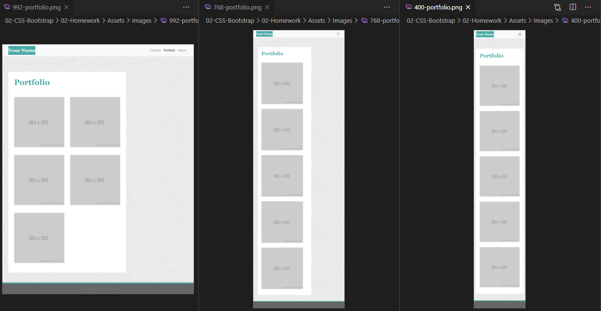
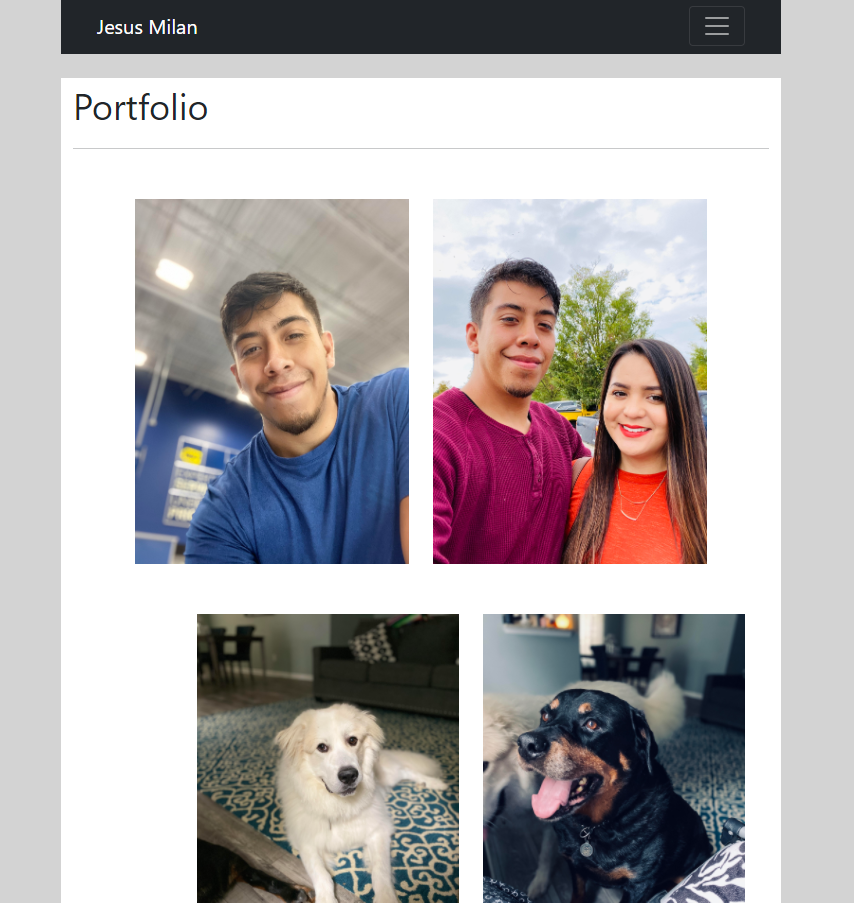
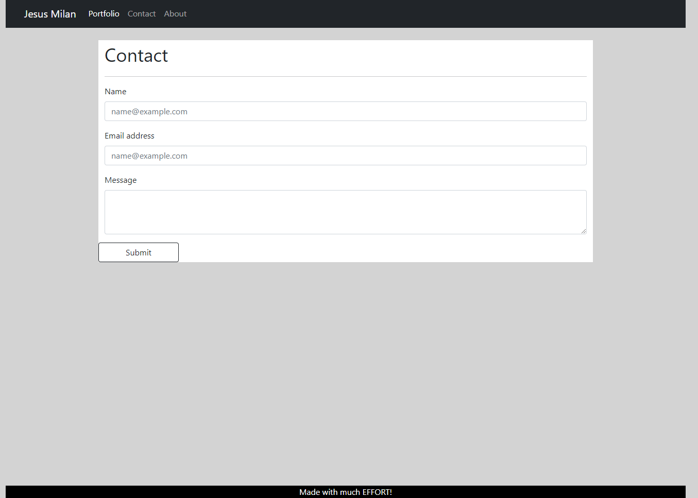
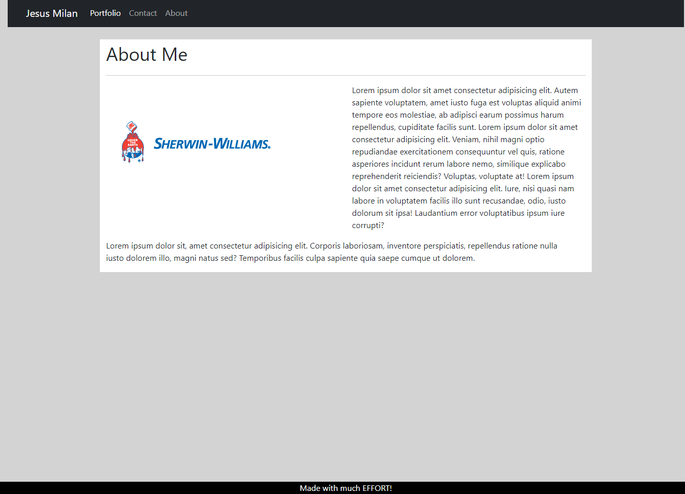

# HW2-Responsive-Portfolio

## What is HW2 about?
This week we are trying to create a responsive portfolio webpage that includes a navbar, layout, text, and images which respond to diferent screen sizes.
We have to accomplish this by using Bootstrap's Grid System.

## What is your plan to tackle this assigment?
First we need to get familiar with Boostrap's documentation.
Then, we need to sketch how our webpage needs to look like in order to best specify the use of containers, rows, and columns.
We can use starter and given blocks of code from Boostrap's webpage, then we can customize by using a css file.
Also we still implement semantic tags where we can without modifying BS's preset blocks.
In our css file we can then change things like background color and margins to best accomodate for screen size.
We implement different breakpoints in our columns to add reponsiveness for smaller screens.

## What did I get out of this week's homework?
I got to have a firm grasp in bootstrap's grid system and how other componets relate to its container.
I still yet to fully understand specific modifications that I want to do with BS however the overall subject has clicked with me.
I see how strong of a tool BS is when doing front end development and once I can get a better understanding make beautiful responsive designs.

## Starter Code Unchanged
 

## End results

[GitHub:] 
[GitHubPages:]

